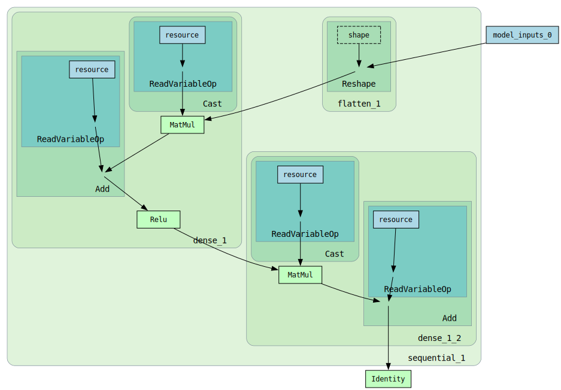

# `tf-deepviz`: Tensorflow / Graphviz deep SVG graph rendering

## Introduction

`tf-deepviz` makes it easy to immediately see Tensorflow graphs rendered as a basic SVG.

Although other tools such as Tensorboard have far more bells and whistles, with `tf-deepviz` it's trivial to quickly generate an SVG without having to fire up a bunch of heavy stuff.

## Quickstart

### Keras example

#### Example model:

```python
# Official Tensorflow "Hello, world" example:
model = tf.keras.models.Sequential(
    [
        tf.keras.layers.Flatten(input_shape=(28, 28)),
        tf.keras.layers.Dense(128, activation='relu'),
        tf.keras.layers.Dropout(0.2),
        tf.keras.layers.Dense(10),
    ]
)
```

**Write SVG to file:**

```python
import tfdeepviz

tfdeepviz.to_svg(model, 'out.svg')
```

OR **Display SVG directly in Jupyter Lab:**

At the end of a cell:

```python
tfdeepviz.to_digraph(model)
```

OR explicitly using `IPython.display`:

```python
from IPython.display import display

display(tfdeepviz.to_digraph(model))
```

**Output |** Hello World (minimal):


### Additional render options

Additional rendering options can be specified by passing a `tfdeepviz.RenderOptions(...)` object.

For example, `tf-deepviz` does a little bit of graph filtering to remove extraneously noisy nodes from the internal Tensorflow operation graph representation, but it can be useful to see the full, unadulterated operation graph by disabling "minimal" mode:

```python
options = tfdeepviz.RenderOptions(minimal=False)
tfdeepviz.to_digraph(model, options=options)
```

**Output |** Hello World (non-minimal):



## Features

As you can see in the above example, the output is quite low-level and non-sugarcoated.  This is how Tensorflow at its core sees the graph, regardless of any of the extra, higher level Keras fluff is doing.  The crudeness might be a blessing or a curse, depending on what you're after.

If you want a higher level view instead, you should probably use TensorBoard; but if you want to quickly see what's happening beneath the models as in the above, `tf-deepviz` may be useful.

## See also

- [TensorBoard](https://www.tensorflow.org/tensorboard)
- [pytorchviz](git@github.com:szagoruyko/pytorchviz.git)
- [tfgraphviz](https://github.com/akimach/tfgraphviz)
